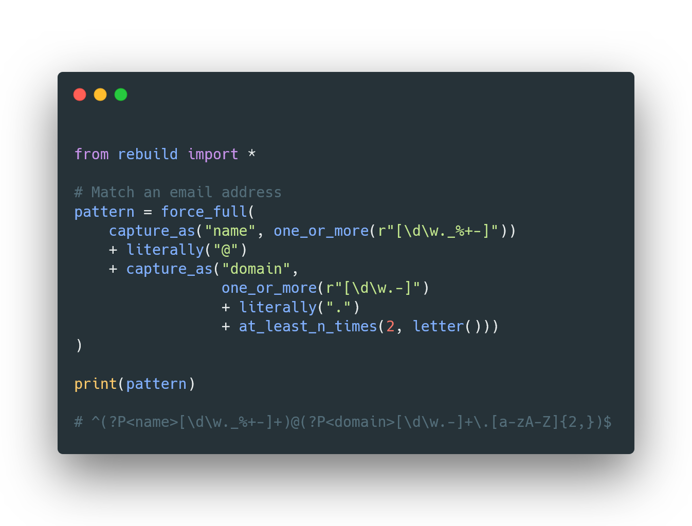

# ReBuild

Generate Python flavoured regex patterns with functions

### Why Rebuild?

- Helps you write **maintainable** regex patterns, that are **readable**, regardless of how good you are at regex
- ReBuild creates **optimised** regex patterns by **analysing** the input patterns
- It uses non-capturing groups as often as possible to **enhance performance**
- Fully **string based**: Can be used with many different tools
- Let's you use your beloved **autocomplete** for generating regex patterns