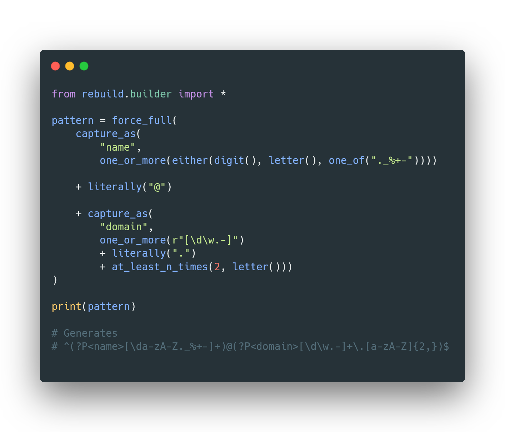

# ReBuild

> Some people, when confronted with a problem, think "I know, I'll use regular expressions." Now they have two problems.
> 
> *-- Jamie Zawinski*

With ReBuild you can write performant regex patterns in a readable and maintainable way by using functions. It is inspired by the Simple Regex Language ([SRL - Simple Regex Language](https://simple-regex.com/)).

### Why Rebuild?

- Helps you write **maintainable** regex patterns, that are **readable**, regardless of how good you are at regex

- ReBuild creates highly **optimised** regex patterns by **analysing** the input patterns

- It uses non-capturing groups as often as possible to **enhance performance**

- Fully **string based**: It's **versatile** and can be used with many different tools

- Lets you use your beloved **autocomplete** for generating regex patterns

- Helps you discover new ways of writing regex patterns, that involve **more code reuse** 